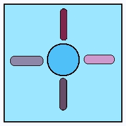
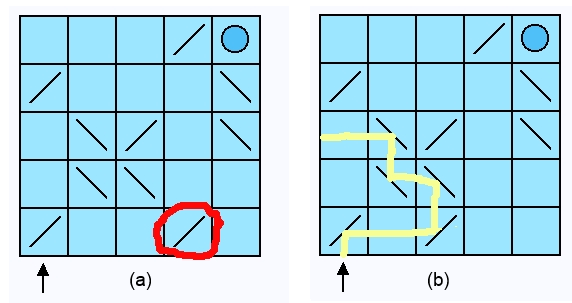
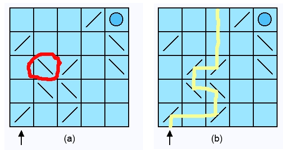
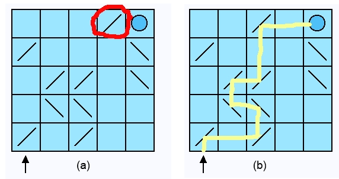
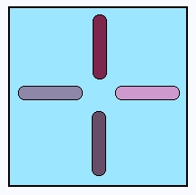
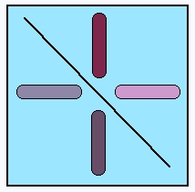
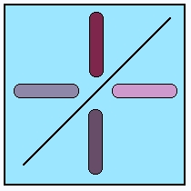

# Introduction

This book builds a game, one test at a time.
This first chapter says who the book is for, where the game comes from, what it leaves to other books, how to read the code in it, and where to get the finished code if you want to look ahead.

The game is a puzzle.
A laser fires into a grid of cells, bounces off mirrors the player can turn and push around, and should end up hitting a target.
The player's job is to get the beam to the target by the longest route they can find.



Building it is an excuse to practise three things, and those three things are what this book is really about.

**Writing the test first.** Every piece of behaviour in the game arrives twice: first as a test that fails, then as the code that makes it pass.
By the end you will have written more than two hundred of them, and you will have felt why they are worth writing — not because a book said so, but because they catch you being wrong, over and over, in the next chapter.

**Recognising a shape in the code.** Some problems have been solved so many times that their solutions have names.
When the game needs one — asking an object what it is instead of testing its class, letting two objects decide something together, building an object lazily, sharing the setup of a test — this book stops and names it, says why that shape fits, and shows what the clumsy version would have looked like.

**Hunting the bug you just made.** Code goes wrong.
A good part of this book is spent in the debugger, reading a failing assertion, or staring at a game that looks right and is not.
These chapters are the ones kept most carefully, because watching someone find a bug teaches more than watching them avoid one.

The graphics are built with **Bloc**, which is how you build a user interface in Pharo today.
No previous experience with it is assumed.

## Who this book is for

Someone who is new to Pharo.
Possibly new to programming altogether.

You do not need to know Smalltalk.
Vocabulary is explained the first time it appears, and the first chapters go slowly.
You do need a Pharo 13 image, and the patience to type the code rather than copy it — the typing is where the learning happens.

The pace is deliberate.
Every step is shown, including the wrong ones, because a tutorial where nothing goes wrong teaches you nothing about what to do when something does.

## Where the game comes from

In 2007 Stephan Wessels wrote the Laser Game as a tutorial for Squeak, and it became one of the best-loved teaching projects in that community.
Pharo is a descendant of Squeak, and the game has been rebuilt here in modern Pharo: the model is much as he designed it, and the teaching order is his.

The graphics are new, because the toolkit is.
Stéphane Ducasse made an earlier Pharo adaptation, which this book also draws on.

Thanks are owed to both of them.

## What this book does not cover

The Pharo community has good books on these already, and this one points at them rather than repeating them:

- installing Pharo and setting up an image — see the **Pharo by Example** book at
  <https://books.pharo.org>;
- saving your code with Git, from inside Pharo — see the booklet **Managing Your Code with
  Iceberg**, at <https://books.pharo.org>;
- packaging an application for someone else to run.

## Conventions used in this book

A class name or a method name in the narrative looks like `Grid` and `rotateClockwise`.

A method is shown with the class it belongs to in front of it:

```smalltalk
MyClass >> myMethod

	^ 1 + 2
```

> **Note.** Do not type the `MyClass >>` part.
> It tells you which class to select in the browser before you type the method.
> What you actually type is just the method:
>


> ```smalltalk
> myMethod
>
> 	^ 1 + 2
> ```

The caret `^` means *answer this*.
The method above answers `3` to whoever called it.

A line of code to run on its own — in a Playground, with the result printed — is shown without a class in front of it:

```smalltalk
3 + 4
```

Some methods are written more than once.
You write a first version that does what the chapter in front of you needs, and a later chapter replaces it when the game asks for more.

The text always says when that happens, and a version that a later chapter supersedes is shown without syntax colouring, so a coloured block is always the final one.
The last version of a method in the book is the one the finished game holds.

## Getting the finished code

You can write every line of the game yourself, which is the point of the book.
If you would rather read the finished version alongside it, this loads it into a Pharo 13 image:

```smalltalk
Metacello new
	baseline: 'LaserGame';
	repository: 'github://rvillemeur/PharoLaserGameTutorial/src';
	onConflictUseIncoming;
	load
```

Then evaluate `LaserGameElement openExample` to play.

## License

Copyright 2007 Stephan Wessels.
Copyright 2014 Stephan Wessels and Stéphane Ducasse.

This book is available under the Creative Commons Attribution-ShareAlike 3.0 Unported license.

*You are free:*

- to Share — to copy, distribute and transmit the work;
- to Remix — to adapt the work.

*Under the following conditions:*

- **Attribution.** You must attribute the work in the manner specified by the author or licensor,
  but not in any way that suggests they endorse you or your use of the work.
- **Share Alike.** If you alter, transform, or build upon this work, you may distribute the result
  only under the same, a similar, or a compatible license.

For any reuse or distribution you must make the license terms clear to others; a link to <http://creativecommons.org/licenses/by-sa/3.0/> is the easiest way.
Any of these conditions can be waived with permission from the copyright holder, and nothing in the license impairs the author's moral rights.


# Game overview

Before writing any code, let us be clear about what the game does.
Not precisely — the design will change several times as we go, and watching it change is part of the point — but clearly enough to start.

By the end of this chapter you will know the board, the two moves a player can make, and what the laser does when it meets a mirror or the target.
There is no code in it.

The game is played on a grid of square cells.
A laser fires into the grid from below the first column, and travels in a straight line until something stops it or turns it.
Each cell is one of three things:

- a **blank cell**, which the beam passes straight through;
- a **mirror cell**, which deflects the beam ninety degrees. A mirror leans one of two ways, left
  or right;
- the **target cell**, drawn as a circle, which lights up when the beam reaches it.

If the beam runs into the edge of the grid, its path simply ends there.


The game lays out the mirrors for you, in random places and random orientations.
In figure (a) above, that random layout happens to send the beam to the target.
The player's two moves are:

- **rotate a mirror**, turning it ninety degrees, which changes where it sends the beam — figure
  (b);
- **push a mirror** one cell up, down, left, or right. A mirror cannot be pushed through the edge of
  the grid, nor into another mirror, nor into the target.

So a game that already works is not very interesting.
What makes it a puzzle is the second goal: get the beam to the target by the *longest* path you can.
Here is one sequence of moves doing exactly that.
First, slide a mirror one cell to its left:



The beam now misses the target, which is fine — a move is allowed to break the path.
Next, rotate another mirror:



And one last move brings the beam back to the target, by a route longer than the one we started with:



That is the whole game.
As we build it we will add things that let the player see what is happening: a count of how many cells the beam crosses, a count of moves made, an undo button, a reset button.

Now let us find the objects.

# Discovery of objects

When we look over the game drawings and think about what objects our game may need, a few come immediately to mind.
There must be some kind of grid and several cells.
There are different kinds of cells too.

In this chapter we turn that reading into four classes, `Cell`, `BlankCell`, `MirrorCell` and `TargetCell`, and make the package that holds them.

Cells and a grid are obvious objects of the game and we will probably discover other objects as we explore a little.
It is perfectly fine to explore and then throw code away if we later learn we are not heading in the right direction.

Exploring with objects is easy to do in Pharo.
Thinking about a design is time well spent, but you also need to dive in sometimes to understand the objects your design needs.
As someone once said, you can read about swimming all you want, but you will never learn about swimming until you actually dive in the water.

The water here is safe.
The worst we could do is write some code and throw it away, and that is nothing to worry about: Pharo keeps a version history of every method, so you can review what you had before and put it back in a couple of clicks.
Development in Pharo encourages experimentation and quick idea exploration.

## The grid

The grid holds our cells.
It also contains the source of our laser beam.
Let us go with the idea that the player asks the grid to fire the laser beam.

## The cells

We identify three kinds of cell.

1. Blank, that is to say empty
2. Target
3. Mirror

The basic responsibility of a cell concerns what happens to the laser beam when it enters the cell.
The mirror cells also need to know something about their orientation: a mirror cell can be thought of as leaning left or leaning right.

If we dig a little deeper into our understanding of these cells we can imagine that each cell has four internal line segments, something like an LED clock.
We use these segments to show the path of the laser beam.
Let us explore how that works for each cell type.

### The blank cell



We label the four segments `#north`, `#east`, `#south` and `#west`.
If the laser beam enters by the `#west` segment then we know the `#east` segment lights up.
If it enters by `#south` then `#north` lights up.

### The mirror cell





Depending on the orientation of the mirror we can also determine the path of the laser beam through the cell.
We identify the corresponding segments using the same technique.

For the left leaning mirror cell, a beam entering by the `#west` segment leaves by the `#south` one.
For the right leaning mirror cell, a beam entering by the `#west` segment leaves by the `#north` one.

### The target cell


In the case of the target cell no other segment lights up.
The laser beam ends its path here.

## Identifying the classes

Visually, each of the three cell types renders differently.
So they have some things in common and some things that are unique to each.
Let us define our initial classes to be:

* `Grid`
* `BlankCell`
* `MirrorCell`
* `TargetCell`

We suspect that there may be an abstract class that unifies the behavior common to the three cells.
For now let us not do that, and stick with these classes until the need for another one actually exists.

Instances of `Grid` are responsible for the board and the overall management of the cells.
Instances of `BlankCell` are the default condition in our grid.
`MirrorCell` instances are not as frequent and are also contained in the grid.
There is one `TargetCell` instance in the grid.

## A package for the model

First we should define a package to hold our classes.
Classes that work together belong together, and a package is what you load, save, and commit as a whole.

Open a System Browser, right-click the package list, choose *New package*, and name it `Laser-Game`.

Pharo groups code at two levels.
A **package** is the unit you load, save, and commit as a whole.
Inside a package, **tags** sort the class list into groups; a tag is a convenience for whoever reads the class list and has no effect on how the code runs.

This book uses one package, `Laser-Game`, with the tags `Model` and `Graphics`, and adds a second package, `Laser-Game-Tests`, once there are enough tests to be worth keeping apart.

> **Note.** Until that split, which is the subject of the chapter *Tests in their own package*, everything lives in `Laser-Game`.

## Creating the model classes

With `Laser-Game` selected, the browser shows a class creation template in its bottom pane.
Fill it out and accept it with the context menu or with `Cmd-S` / `Alt-S`.
Every class needs a superclass; the easiest thing to do for now is to subclass `Object`.
We refactor that later, once the design structure is fleshed out.

```smalltalk
Object << #Grid
	slots: {};
	tag: 'Model';
	package: 'Laser-Game'
```

> **Note.** Reading that definition: `Object << #Grid` says *make a class named `Grid` whose superclass is `Object`*, and answers a class builder that the three following messages configure.
> `slots: {}` gives the class no instance variables — no state of its own — for now.
> `tag: 'Model'` files it under `Model` in the class list, and `package: 'Laser-Game'` says which package owns it.
> Accepting the definition in the browser is what actually creates the class.
>
> This is the definition as it stands at this point in the book.
> `Grid` collects six instance variables as we go, and its finished definition is in the chapter *Grid*.

Then define the three cell classes the same way.

```smalltalk
Object << #BlankCell
	slots: {};
	tag: 'Model';
	package: 'Laser-Game'
```

```smalltalk
Object << #MirrorCell
	slots: {};
	tag: 'Model';
	package: 'Laser-Game'
```

```smalltalk
Object << #TargetCell
	slots: {};
	tag: 'Model';
	package: 'Laser-Game'
```

> **Note.** All three definitions are rewritten before this section is over.
> `MirrorCell` gains a `leansLeft` instance variable in *Enhancing MirrorCell*, and that same chapter puts the three cells under a common superclass `Cell`, which is where the state they share ends up.

Before implementing the behavior of our model we define tests that specify that behavior.
The tests help us make sure our implementation is correct, and they document the behavior in a way that can be checked automatically.

# Test driven development

We use the SUnit testing framework to implement the game model.
We will most likely not write unit tests for the behavior of the user interface, which is tedious to do; but there is plenty we can accomplish by driving the development of the game model from unit tests.

So we make a second package for the tests, write the first one, run it, and read the error it gives us.
The test is still red when the chapter ends, and that is the point of it: the next chapter makes it green.

We are not too attached to how we code the very first few lines.
One approach many people use is to begin with the tests, even to the point of having no objects to test when the first test is written.
Another is to implement some basic model and drive it from that point forward with tests.

What matters is what unit tests accomplish:

1. They help us develop our objects, because writing a test that exercises an object's API makes us consider how that object will be used.
2. They provide a consistency check as we add and evolve code. This tells us quickly when and where we break something that already worked.

Good unit tests capture your requirements and help you as you implement a design.
Often, when you write a unit test, you are forced to think about your design as if it were finished.

## A package for the tests

The `BlankCell` is an excellent place to begin.
We want a package to hold our test classes, which in turn hold the methods defining our test cases.

Right-click the package list, choose *New package*, and name it `Laser-Game-Tests`.
The newly created package is selected and a class definition template appears in the code pane.

By convention a test class is named after the class it tests, with `Test` or `TestCase` on the end.
This book uses `TestCase`, so the class we are about to write is `BlankCellTestCase`.

```smalltalk
TestCase << #BlankCellTestCase
	slots: {};
	package: 'Laser-Game-Tests'
```

> **Note.** Pay attention to the superclass.
> A test class must be a subclass of `TestCase`, and it is easy to overlook.
> If you got it wrong, go back, correct it, and accept the definition again.

## The first test

Within a class, methods are sorted into *protocols*, shown in the third pane of the browser.
Our tests go in a protocol named `tests`.
Select the class, right-click the protocol list, choose *Add protocol*, type `tests` and accept.

> **Note.** Make sure the browser is showing instance methods and not class methods, that is to say that the *Class side* button under the class pane is not pressed.
> The methods we write now are sent to instances.

Our first test is a simple check that a cell is off by default.
Select the `tests` protocol and replace the method template with the test.

```smalltalk
BlankCellTestCase >> testCellOnState

	| cell |
	cell := BlankCell new.
	self assert: cell isOff.
	self shouldnt: [ cell isOn ]
```

> **Note.** Two things about that test.
> Its name begins with `test`, which is how the test framework recognises a test method — a method named anything else is never run.
> And `self shouldnt: [ cell isOn ]` and `self deny: cell isOn` both assert that something is false: `shouldnt:` takes a block, `deny:` takes the value.
> Either is correct, and later tests in this book mostly use `deny:`.

If the method lands in a protocol named *as yet unclassified*, no protocol was selected when you accepted it.
Drag it onto `tests` and it moves.

Before we can run this test we need definitions of `isOn` and `isOff`, so that the methods exist when the test sends them.
For now we write dummies that both answer `false`.

Select `BlankCell` in the `Laser-Game` package, add a protocol `testing`, and accept the two methods below.

```st
isOff
	"dummy definition"
	^ false
```

```st
isOn
	"dummy definition"
	^ false
```

> **Note.** These two are deliberately wrong and they do not survive the chapter *Getting our first test to pass*, which gives them their real bodies.
> The finished code has both on `Cell`, not on `BlankCell`.

While you type, the top right corner of the code pane is tinged with orange: the edit has not been compiled yet.
Accepting the method compiles it and the tinge goes away.
Each time you edit an existing method and accept it, the old body is replaced by the new one.

## Running the test

Even though we know `isOn` and `isOff` are wrong, we should run `testCellOnState`.
Enough code has been written that we want to be sure `BlankCell` objects are created correctly and that the test produces the wrong result we are expecting.

* Open the Test Runner from the World menu.
* Filter the package list by typing `Laser` in the input field at the top left.
* Select the package `Laser-Game-Tests` and the class `BlankCellTestCase`.
* Press *Run Selected*.

> **Note.** If `Laser-Game-Tests` does not appear in the Test Runner at all, you probably made a mistake creating the test class.
> `BlankCellTestCase` must be a subclass of `TestCase`.

There is a second way to run tests, from the System Browser itself.
Next to the name of a test method is a small circle that shows the result of the last run: green for a pass, yellow for a failure, red for an error.

Click it and that one test runs.
There is a similar circle next to the test class, and clicking it runs every test of the class.

## Getting to the error

The Test Runner reports one failure and lists the method that failed.
Click the failed test and a debugger opens on it.

Navigate the call stack by clicking the lines of the top pane, and the variables listed below change with the selected frame.
You can inspect any of them from their context menu, and you can select any piece of code in the method and inspect or evaluate it.

Later we show that you can also change the method and carry on from where you were.

# Getting our first test to pass

Our first test is currently this one.
To make it green, `BlankCell` needs somewhere to keep the state of its four segments, an `initialize` that fills it, and the two methods the test calls.
We write all three in this chapter, and finish with the first class comment of the book.

```smalltalk
BlankCellTestCase >> testCellOnState

	| cell |
	cell := BlankCell new.
	self assert: cell isOff.
	self shouldnt: [ cell isOn ]
```

We knew it would fail before we ran it, because we have not really defined `isOff` or `isOn`.
Following the LED clock analogy, to know whether a cell is on we have to look at its four internal line segments: if any of them is lit, the cell is on.

## Holding the segments

Before we can finish `isOn` and `isOff` we need somewhere to keep the segments.
We add an instance variable holding a dictionary that maps each side to whether it is lit.

Select `BlankCell`, edit its definition to add the slot and accept.

```smalltalk
Object << #BlankCell
	slots: { #activeSegments };
	tag: 'Model';
	package: 'Laser-Game'
```

Accepting this does not only change what new instances look like: every `BlankCell` that already exists in the running image gets the new instance variable too.

Now use the refactoring tools to write the accessors.
Select the class, then *Refactoring > Instance variables > Accessors*, pick `activeSegments` from the list and accept the proposed changes.
Two methods appear in the `accessing` protocol.

Since the variable holds a dictionary, rename the argument of the setter to say so.
That changes nothing for the compiler; it is documentation.

> **Note.** The two accessors are quoted in the chapter *Enhancing MirrorCell*, which is where they end up: they move to the common superclass `Cell` along with the instance variable itself.

> **Note.** Writing accessors is not mandatory, especially for private state that only the methods of the class touch.
> Different schools propose different practices with different trade-offs.
> We write them here for uniformity throughout the book.

## Initializing instances

The new variable has to be initialized.
Add an `initialization` protocol to `BlankCell` and define the method that fills the dictionary; every side starts off.

```st
initializeActiveSegments
	self activeSegments: Dictionary new.
	self activeSegments at: #north put: false.
	self activeSegments at: #east put: false.
	self activeSegments at: #south put: false.
	self activeSegments at: #west put: false.
```

That method has to be called.
There are two ways: specialize the default `initialize` method, or initialize lazily.
Let us do the first.

```st
initialize
	super initialize.
	self initializeActiveSegments
```

> **Note.** Both of these end up on `Cell`; `initializeActiveSegments` is quoted from the image in *Enhancing MirrorCell*, along with the `initialize` that calls it.

In Pharo, `new` sends `initialize` to the newly created instance, so overriding `initialize` is how a class customizes its own creation.

The first thing our `initialize` does is `super initialize`.
That is a good habit: since we are overriding a method, it is conceivable that we are hiding an important initialization somewhere up the hierarchy, and calling `super` first gives every superclass the chance to do its part.

### An alternative: lazy initialization

Another approach initializes the variable the first time it is read.
The getter checks whether the variable is still `nil` and fills it if it is, and the other methods of the class go through the getter instead of touching the variable.

```st
activeSegments
	^ activeSegments ifNil: [ self initializeActiveSegments ]
```

Lazy initialization is useful in a live environment where instance variables are added to objects that already exist: their `initialize` has already run once and running it again would be awkward.

It also helps when initializing everything at creation time costs too much, by paying for each variable only when it is really needed, at the price of one `ifNil:` check per access.
Which approach wins depends on the application, and that is a question for a profiler.

> **Note.** This game uses both.
> The cells initialize eagerly, as above.
> the game window's `grid` method, written much later in *A default board worth playing on*, is lazy, so that a game built with no board deals itself the standard one the first time it is asked for it.

## Getting the test green

Now we can write `isOn` for real.
`activeSegments` answers a dictionary whose values say which segments are lit; as soon as one of them is true the cell is on.

```st
isOn
	^ self activeSegments values anySatisfy: [ :each | each = true ]
```

Since the values are booleans you could equivalently write `anySatisfy: [ :each | each ]`.
Once `isOn` is defined, `isOff` follows naturally.

```st
isOff
	^ self isOn not
```

Rerun the test.
It passes.

> **Note.** Both methods are quoted from the image in *Enhancing MirrorCell*, where they live on `Cell`.

## Adding a class comment

It is not good practice to leave classes undocumented, and the browser says so with a mark against the class name until you write a comment.
Select `BlankCell`, press the *Comment* button and write what the class is for.

```text
I am a `Cell` the beam crosses in a straight line. A beam entering from the west leaves by the east, one entering from the south leaves by the north, and the same in reverse.

I add no state to `Cell`. All I do is fill `exitSides` in `initializeExitSides`, which is what makes a cell blank. Every empty square of the board holds one of me.
```

Accept it and the mark is gone.

# Saving your work

Your code lives in the image, and an image is an easy thing to lose.
Saving means putting your packages somewhere outside it, so that you can load them into a fresh image or go back to an earlier state of the project.

This is a good moment to set that up, because the tests are green.
This is a short chapter, and it points at a book rather than repeating it.

Pharo does it with **Iceberg**, which is part of the standard image and commits your packages to a Git repository.
It writes each package out as a directory of readable text files, one per class, so the game can be read, diffed, and merged with the usual Git tools.

We will not explain Iceberg here, because a book already does it well and is kept up to date with the image: the booklet *Managing Your Code with Iceberg*, from <https://books.pharo.org>.
It covers cloning a repository, putting a package into it, committing, branching, and the traps you can fall into.

One habit matters more than the tool, and this book follows it from here on:

**Commit when the tests are green.** Then every state you can go back to is a state in which the game worked.

# Coding in the debugger

Some developers write the test first, let it fail, and then define the methods it needs from inside the debugger.
Why?
Because in the debugger you work against live objects, in the context of the running program.
You write code, execute it against those objects, save it and carry on from where you stopped.

In this chapter we break `isOn` and `isOff` on purpose, run the test, and repair both of them from inside the debugger without ever going back to the browser.

## Setting up the context

Temporarily redefine `isOn` and `isOff` on `BlankCell` so that they stop instead of answering.

```st
isOff
	"dummy definition"
	^ self halt
```

```st
isOn
	"dummy definition"
	^ self halt
```

`self halt` is the normal way to set a breakpoint: when it runs, a debugger opens.
Here we are only using it to produce something to fix on the fly.

## Coding in the debugger

Run `testCellOnState`.
The debugger opens on the halt.
Navigate the stack and find the method that raised it, usually near the top of the list; here it is `isOff`, with the `halt` highlighted.

Now, in the debugger itself, restore `isOff` to what it should be and accept it.

```st
isOff
	^ self isOn not
```

The moment you accept, the method is recompiled and the debugger re-enters it: the highlight moves to the `isOn` send, which is where execution resumes from.
Press *Proceed* and the `halt` in `isOn` is reached in its turn.
Restore that one too.

```st
isOn
	^ self activeSegments values anySatisfy: [ :each | each = true ]
```

Press *Proceed* and the test finishes green.

> **Note.** The debugger does more than edit existing methods.
> When execution reaches a message no object understands, the debugger offers to create the method for you: it asks which class it belongs to and which protocol to file it under, then steps into the new method with a `shouldBeImplemented` body waiting to be replaced.
> We use that in the next chapter.

## Conclusion

We do not repeat this process in the rest of the tutorial, but we use it daily.
It is one of the things Pharo does that is hard to explain and hard to give up, and we can only encourage you to try it.

# Improving our model

Now that the first test is green we can add behavior, and we do it test first.
Three tests and three methods in this chapter: `isSegmentOnFor:`, which answers whether one segment is lit, `exitSideFor:`, which says where a beam leaves, and `laserEntersFrom:`, which lights the segments a beam crosses.

Along the way the debugger writes a method for us, and we note what using symbols for directions will cost us later.

## Asking whether one segment is on

We want to ask a cell whether the segment of a given side is lit.
A new cell has all of them off, so the test is simple.

```smalltalk
BlankCellTestCase >> testCellSegmentState

	| cell |
	cell := BlankCell new.
	self shouldnt: [ cell isSegmentOnFor: #north ].
	self shouldnt: [ cell isSegmentOnFor: #east ].
	self shouldnt: [ cell isSegmentOnFor: #south ].
	self shouldnt: [ cell isSegmentOnFor: #west ]
```

When you accept this, the compiler does not know `isSegmentOnFor:` and asks you to confirm, correct, or cancel the unknown selector.
Confirm: we mean it, the method does not exist yet.

Run the test.
The debugger opens with a message-not-understood: the receiver is the `BlankCell` held by `cell` and it does not understand `isSegmentOnFor:`.
Press *Create*, choose `BlankCell` as the class and `testing` as the protocol.

The debugger steps into the method it just created for you, whose body is `self shouldBeImplemented` — a placeholder that opens the debugger again if you walk away and leave it there.
Replace it and accept.

```st
isSegmentOnFor: aSymbol
	^ self activeSegments at: aSymbol
```

> **Note.** This method ends up on `Cell`, where it is quoted from the image in the next chapter.
> The test above, on the other hand, is quoted from the image as it stands.

## Where the beam leaves

We know how to look at one segment.
Now we need to know which side a beam leaves by, given the side it came in from.

```smalltalk
BlankCellTestCase >> testCellExitSides

	| cell exit |
	cell := BlankCell new.
	exit := cell exitSideFor: #north.
	self assert: exit equals: #south.

	exit := cell exitSideFor: #east.
	self assert: exit equals: #west.

	exit := cell exitSideFor: #south.
	self assert: exit equals: #north.

	exit := cell exitSideFor: #west.
	self assert: exit equals: #east
```

> **Note.** The message is `exitSideFor:`, not `exitFor:`, because it answers a *side*.
> Saying so in the name saves the reader a trip into the method body.
> And the distinction the name draws is the one this test makes: a beam entering by the north side of a blank cell leaves by the south side.
> This is about sides, not about directions.

The cell needs somewhere to keep that mapping, so `BlankCell` gains a second instance variable, `exitSides`, holding a dictionary from the side a beam enters by to the side it leaves by.
Add the slot to the class definition and create its accessors the way you did for `activeSegments`.

```smalltalk
Object << #BlankCell
	slots: { #activeSegments . #exitSides };
	tag: 'Model';
	package: 'Laser-Game'
```

Then fill the dictionary.
This is the method that makes a cell blank: north to south, east to west, and the same in reverse.

```smalltalk
BlankCell >> initializeExitSides
	self exitSides: Dictionary new.
	self exitSides at: #north put: #south.
	self exitSides at: #east put: #west.
	self exitSides at: #south put: #north.
	self exitSides at: #west put: #east.
```

And call it from `initialize`.

```smalltalk
BlankCell >> initialize
	super initialize.
	self initializeExitSides.
```

Finally the lookup itself.

```st
exitSideFor: aSymbol
	^ self exitSides at: aSymbol
```

> **Note.** `initializeExitSides` and `initialize` are quoted from the image and stay on `BlankCell` for good: filling `exitSides` is exactly what a subclass of `Cell` is for.
> `exitSideFor:` moves up to `Cell` in the next chapter.

## Telling the cell the beam entered

The last piece of behavior for now is to tell a cell that the laser beam has entered it from a given side.
The cell should light the side the beam arrived by and the side it leaves by.

```smalltalk
BlankCellTestCase >> testCellLaserActivity

	| cell |
	cell := BlankCell new.
	cell laserEntersFrom: #north.
	self assert: cell isOn.
	self assert: (cell isSegmentOnFor: #north).
	self assert: (cell isSegmentOnFor: #south).
	self shouldnt: [ cell isSegmentOnFor: #east ].
	self shouldnt: [ cell isSegmentOnFor: #west ]
```

Run it, and create the method from the debugger as before.

```st
laserEntersFrom: aSymbol
	| exit |
	self activeSegments at: aSymbol put: true.
	exit := self exitSideFor: aSymbol.
	self activeSegments at: exit put: true.
```

> **Note.** You could go one step further and hide the two dictionary writes behind methods named `setSegmentOnFor:` and `setSegmentOffFor:`, then write `laserEntersFrom:` in terms of those.
> Nothing else in the game ever needs to light one segment on its own, so this book stops here — but the idea is worth keeping: a method reads better when it says *what* it does than when it shows *how* it stores things.

## A word about directions

The design we have proposed uses symbols to represent the sides.
That is fine, but it has a weakness worth naming: symbols are carried around everywhere and nothing checks them.
Mistype `#west` as `#vest` and the system quietly stops working.

One cheap improvement is to define the four symbols in one place, as class methods answering `#north`, `#south`, `#east` and `#west`, and use those everywhere instead of the literals.
A good acid test of that design is that you could replace the symbol in each method by a number and the system would carry on working.

A stronger answer is to make the directions real objects.
That is where this game ends up: *Push a cell* introduces a `GridDirection` hierarchy with one subclass per direction, each knowing its own vector and the side of a cell a beam travelling that way enters by.

It removes the last case statement from the beam path, and it is a good example of what you get for making a value into an object.

# Enhancing MirrorCell

A `MirrorCell` differs from a `BlankCell` in that it carries a mirror, and the mirror can be oriented to send the laser beam in different directions.

In this chapter the mirror cell learns which way it leans, with `isLeft` and `isRight`, and the three kinds of cell get the common superclass they have been asking for: everything they repeat moves up to `Cell`.
That move is the first refactoring of the book.
Let us start with the class comment.

```text
I am a `Cell` with a mirror on one of its diagonals. `leansLeft` says which one. When I lean left the mirror runs from my top left corner to my bottom right one, and a beam entering from the north leaves by the east. When I lean right it runs from my top right corner to my bottom left one, and the same beam leaves by the west.

`leanLeft` and `leanRight` set the lean and all four exit sides together, which is why `rotate` uses them instead of flipping `leansLeft` on its own. A lean changed without its exit sides is a bug that is hard to see: the mirror is drawn on the new diagonal while the beam still leaves by the old side.

`rotateClockwise` and `rotateCounterClockwise` are both `rotate`. A diagonal has only two positions, so either direction lands on the other one.
```

> **Note.** That is the comment the class ends up with.
> `rotate` and the two rotate messages do not exist yet — they arrive later in this chapter — so write the first paragraph now and come back for the rest.

## Capturing the orientation

We need a way to hold the orientation of the mirror.
The default is that the mirror leans left unless something says otherwise, and we need to be able to ask which way it leans.

Add the instance variable `leansLeft` to the class definition and create its accessors.

```smalltalk
Object << #MirrorCell
	slots: { #leansLeft };
	tag: 'Model';
	package: 'Laser-Game'
```

Then add a `testing` protocol with the two questions.

```smalltalk
MirrorCell >> isLeft
	^self leansLeft
```

```smalltalk
MirrorCell >> isRight
	^self isLeft not
```

## Introducing a common ancestor

That much was straightforward.
But what about the behavior a mirror shares with a blank cell?
It needs `laserEntersFrom:`, `exitSideFor:` and `isSegmentOnFor:` just as much, and therefore the instance variables `activeSegments` and `exitSides` too.
Only the way the exit sides are filled differs.

We want to reuse that code, not copy it.
Nearly the same state and nearly the same behavior in two classes is a sign that we can do better, and this is exactly the case an abstract superclass is for.

First create the class `Cell`.

```smalltalk
Object << #Cell
	slots: {};
	tag: 'Model';
	package: 'Laser-Game'
```

And give it a comment.

```text
I am the model of one square of the laser game board. I know where I sit (`gridLocation`, a `column @ row` point), which side a beam leaves by when it enters from a given side (`exitSides`, a dictionary keyed by `#north`, `#east`, `#south` and `#west`), and which of those sides carry light right now (`activeSegments`).

I am abstract: a subclass fills `exitSides` in `initializeExitSides`. `BlankCell` lets a beam straight through, `MirrorCell` turns it a quarter turn, `TargetCell` swallows it and lights up.

`rotateClockwise` and `rotateCounterClockwise` do nothing here, so a click on a cell that cannot turn is harmless. `MirrorCell` overrides both.

`printOn:` prints where I am and whether I am on; a subclass adds its own detail by overriding `printDetailsOn:`. Inspect me and the Sides tab lists my four sides with the side a beam leaves by and whether that side is lit.
```

> **Note.** Again, that is the comment the class ends up with.
> The last two paragraphs describe `printOn:` and the inspector tab, which we write later, and `gridLocation` is the instance variable `Cell` gains in the chapter *Grid*.
> At this point it has neither, so write what is true now and come back.

Pharo comes with a powerful tool for restructuring code: the refactoring engine, reachable from the *Refactoring* item of the class list context menu in the System Browser.
A refactoring is a behavior preserving transformation, which is to say that the program does the same thing after it as it did before.

Smalltalk had the first working refactoring engine of any language, and moving code around a hierarchy is what it is best at.

### Inheriting from Cell

Change the definitions of `BlankCell` and `MirrorCell` so that both subclass `Cell`.
The browser then indents them under it.
Rerun your tests; they still pass.

```smalltalk
Cell << #MirrorCell
	slots: { #leansLeft };
	tag: 'Model';
	package: 'Laser-Game'
```

```smalltalk
Cell << #BlankCell
	slots: {};
	tag: 'Model';
	package: 'Laser-Game'
```

### Moving the instance variables up

Both cells manage which segments are on and how a beam crosses them, so `activeSegments` and `exitSides` belong to the superclass.
Bring up the context menu on `BlankCell`, choose *Refactoring > Instance variables > Pull up* and pick `activeSegments`, then do the same for `exitSides`.

Both variables move to `Cell` and `BlankCell` is left with none of its own, which is what the definition above already shows.

```smalltalk
Object << #Cell
	slots: { #activeSegments . #exitSides };
	tag: 'Model';
	package: 'Laser-Game'
```

What is nice about using the refactorings rather than editing by hand is that they eliminate a class of mistakes.
A subclass could already have an instance variable of that name, for instance, and the tool notices.

### Moving the methods up

The accessors and the behavior follow the instance variables.
Select, in `BlankCell`, the accessors `activeSegments`, `activeSegments:`, `exitSides` and `exitSides:`, the testing methods `isOn`, `isOff` and `isSegmentOnFor:`, and the operations `laserEntersFrom:` and `exitSideFor:`, then choose *Refactoring > Push up* from the selection.
All of them move to `Cell` at once, and here is where they end up.

```smalltalk
Cell >> activeSegments
	"Answer the value of activeSegments"

	^ activeSegments
```

```smalltalk
Cell >> activeSegments: aDictionary
	"Set the value of activeSegments"

	activeSegments := aDictionary
```

```smalltalk
Cell >> exitSides
	"Answer the value of exitSides"

	^ exitSides
```

```smalltalk
Cell >> exitSides: aDictionary
	"Set the value of exitSides"

	exitSides := aDictionary
```

```smalltalk
Cell >> isOn
	^self activeSegments values anySatisfy: [:each | each = true]
```

```smalltalk
Cell >> isOff
	^self isOn not
```

```smalltalk
Cell >> isSegmentOnFor: aSymbol
	^self activeSegments at: aSymbol
```

```smalltalk
Cell >> exitSideFor: aSymbol
	^self exitSides at: aSymbol
```

```smalltalk
Cell >> laserEntersFrom: aSymbol
	| exit |
	self activeSegments at: aSymbol put: true.
	exit := self exitSideFor: aSymbol.
	self activeSegments at: exit put: true.
```

Your tests should still pass.

### Splitting the initialization

That leaves the initialization methods.
`initializeActiveSegments` works for any cell, since every cell has four segments that all start off, so it belongs on the superclass.
`initializeExitSides` does not: it is precisely what makes a blank cell blank.

Push up `initializeActiveSegments` and edit the two `initialize` methods by hand.

```smalltalk
Cell >> initializeActiveSegments
	self activeSegments: Dictionary new.
	self activeSegments at: #north put: false.
	self activeSegments at: #east put: false.
	self activeSegments at: #south put: false.
	self activeSegments at: #west put: false.
```

```smalltalk
Cell >> initialize
	super initialize.
	self initializeActiveSegments.
```

```smalltalk
BlankCell >> initialize
	super initialize.
	self initializeExitSides.
```

`Cell` then says that filling the exit sides is a subclass's job, and says it in a way that fails loudly rather than quietly if a new kind of cell forgets.

```smalltalk
Cell >> initializeExitSides
	"Fill exitSides with the side a beam leaves by for each side it can enter from. Every
	subclass answers this differently, which is what makes a cell blank, a mirror or a target,
	so I am abstract here."

	^ self subclassResponsibility
```

> **Note.** `self subclassResponsibility` means *a subclass has to implement this*.
> It is how an abstract method is written in Pharo: if the method is ever reached, it raises an error naming the class and the method, so a cell that forgot to fill in its exit sides fails loudly and immediately instead of quietly misbehaving three steps later.
> Leaving the method body empty would have hidden the same mistake.

Run the tests.
They pass.

## Tests for MirrorCell

Now we can write the tests for the mirror.
By convention they go in their own class.

```smalltalk
TestCase << #MirrorCellTestCase
	slots: {};
	package: 'Laser-Game-Tests'
```

Start with the state of a newly created mirror, which is the same as for a blank cell: off, with all four segments off.

```smalltalk
MirrorCellTestCase >> testCellOnState

	| cell |
	cell := MirrorCell new.
	self assert: cell isOff.
	self shouldnt: [ cell isOn ]
```

```smalltalk
MirrorCellTestCase >> testCellSegmentState

	| cell |
	cell := MirrorCell  new.
	self shouldnt: [ cell isSegmentOnFor: #north ].
	self shouldnt: [ cell isSegmentOnFor: #east ].
	self shouldnt: [ cell isSegmentOnFor: #south ].
	self shouldnt: [ cell isSegmentOnFor: #west ]
```

### Handling the orientation

We have to set the orientation when the cell is created, and again when the player rotates it.
Before writing the methods, let us write the tests that say what we expect.
The exit sides depend on the orientation, so there is one test per lean.

```smalltalk
MirrorCellTestCase >> testCellExitSidesMirrorLeft

	| cell exit |
	cell := MirrorCell new.
	cell leanLeft.

	exit := cell exitSideFor: #north.
	self assert: exit equals: #east.

	exit := cell exitSideFor: #east.
	self assert: exit equals: #north.

	exit := cell exitSideFor: #south.
	self assert: exit equals: #west.

	exit := cell exitSideFor: #west.
	self assert: exit equals: #south
```

```smalltalk
MirrorCellTestCase >> testCellExitSidesMirrorRight

	| cell exit |
	cell := MirrorCell new.
	cell leanRight.

	exit := cell exitSideFor: #north.
	self assert: exit equals: #west.

	exit := cell exitSideFor: #east.
	self assert: exit equals: #south.

	exit := cell exitSideFor: #south.
	self assert: exit equals: #east.

	exit := cell exitSideFor: #west.
	self assert: exit equals: #north
```

And two more for which segments light up when a beam crosses the cell in each orientation.

```smalltalk
MirrorCellTestCase >> testCellLaserActivityMirrorLeft

	| cell |
	cell := MirrorCell leanLeft.
	cell laserEntersFrom: #north.
	self assert: cell isOn.
	self assert: (cell isSegmentOnFor: #north).
	self assert: (cell isSegmentOnFor: #east).
	self shouldnt: [ cell isSegmentOnFor: #south ].
	self shouldnt: [ cell isSegmentOnFor: #west ]
```

```smalltalk
MirrorCellTestCase >> testCellLaserActivityMirrorRight

	| cell |
	cell := MirrorCell leanRight.
	cell laserEntersFrom: #north.
	self assert: cell isOn.
	self assert: (cell isSegmentOnFor: #north).
	self assert: (cell isSegmentOnFor: #west).
	self shouldnt: [ cell isSegmentOnFor: #south ].
	self shouldnt: [ cell isSegmentOnFor: #east ]
```

The last four fail, of course, since we have not written the methods yet.
Now we can.
Each lean sets the flag and all four exit sides together.

```smalltalk
MirrorCell >> leanLeft
	self leansLeft: true.
	self exitSides at: #north put: #east.
	self exitSides at: #east put: #north.
	self exitSides at: #south put: #west.
	self exitSides at: #west put: #south.
```

```smalltalk
MirrorCell >> leanRight
	self leansLeft: false.
	self exitSides at: #north put: #west.
	self exitSides at: #east put: #south.
	self exitSides at: #south put: #east.
	self exitSides at: #west put: #north.
```

> **Note.** Setting the lean and the four sides in one method is not a matter of taste.
> Changing one without the other is the bug the chapter *Rotate a mirror cell* spends its length hunting, and the fix is to route every change of orientation through these two methods.
> `MirrorCell >> rotate` does exactly that.

A mirror fills its exit sides from whichever lean it is given, so its own `initializeExitSides` only has to create the dictionary, and `initialize` leans left by default.

```smalltalk
MirrorCell >> initializeExitSides
	self exitSides: Dictionary new.
```

```smalltalk
MirrorCell >> initialize
	super initialize.
	self initializeExitSides.
	self leanLeft
```

Run your tests and they should pass.
This is a good moment to save your work.

## Instance creation methods

As a practical matter a mirror always has an orientation, so every time we make one we have to take the extra step of orienting it.
You have seen how that reads in the tests above:

```smalltalk
cell := MirrorCell new.
cell leanRight.
```

It would be nicer to say it in one step:

```smalltalk
cell := MirrorCell leanRight
```

and we can, by defining two *class* methods.
A class method runs when a message is sent to the class itself, as in `MirrorCell leanRight`, whereas an instance method runs when the message is sent to an instance, as in `cell leanRight`.

In the System Browser you write them with the *Class side* button pressed, under the class list.
The `MirrorCell class >>` prefix used in this book means exactly that.

```smalltalk
MirrorCell class >> leanLeft
	"Answer a mirror on the diagonal from my top left corner to my bottom right one."

	^ self new leanLeft
```

```smalltalk
MirrorCell class >> leanRight
	"Answer a mirror on the diagonal from my top right corner to my bottom left one."

	^ self new leanRight
```

> **Note.** Make sure the *Class side* button is pressed before you accept these two, and remember to release it afterwards.
> Defining them on the instance side is the single most common mistake students make in this tutorial, and it shows up as a message-not-understood the first time you write `MirrorCell leanRight`.
> If it happens, delete the instance method and write the class method instead.

> **Note.** Watch the receiver of the cascade if you are tempted to write `^ self new; leanLeft`.
> That sends `leanLeft` to the class, not to the new instance, and answers the class.
> `^ self new leanLeft` is what you want, and it works because `leanLeft` answers the cell.

Check it from a Playground with `MirrorCell leanRight inspect`.
The two tests `testCellLaserActivityMirrorLeft` and `testCellLaserActivityMirrorRight` above already use the new API.

## About the design of MirrorCell

Instead of testing the state all the time with `isLeft` and `isRight`, a cleaner design defines two subclasses of `MirrorCell`, one per orientation, and puts the specific methods in each.

What is important to see is that sending a message already selects the right method for the receiver: message sending *is* a systematic conditional, and every explicit test we write by hand is a place where we are not using the mechanism at the center of object-oriented programming.

This game keeps the flag.
A mirror has exactly two states and it flips between them on every click, so two classes would mean replacing the cell in the grid on every rotation rather than telling it to turn.
It is worth knowing which trade you are making.

# Enhancing TargetCell

The `TargetCell` is the last of our cells.
It is unique in that it has no exit: once the laser beam enters a target cell it does not leave and does not propagate any further.
The design choice we make here is to answer `nil` for every exit side.

It is a short chapter — four tests, one `initializeExitSides`, and a word on why `nil` is the right answer rather than a missing one.
Let us start with tests that say what we mean, and with a comment.

```text
I am the `Cell` the beam is aimed at. Every side of me leaves by nothing, so a beam that enters lights the side it arrived by and stops there. Reaching me is how the game is won.

Like `BlankCell` I add no state to `Cell`; `initializeExitSides` fills `exitSides` with nil for all four sides. `Grid` puts exactly one of me on the board.
```

## Some tests

A new test class, as before.

```smalltalk
TestCase << #TargetCellTestCase
	slots: {};
	package: 'Laser-Game-Tests'
```

At creation the cell is off, and so are all of its segments.

```smalltalk
TargetCellTestCase >> testCellOnState

	| cell |
	cell := TargetCell new.
	self assert: cell isOff.
	self shouldnt: [ cell isOn ]
```

```smalltalk
TargetCellTestCase >> testCellSegmentState
|cell|
cell := TargetCell new.
self shouldnt: [ cell isSegmentOnFor: #north ].
self shouldnt: [ cell isSegmentOnFor: #east ].
self shouldnt: [ cell isSegmentOnFor: #south ].
self shouldnt: [ cell isSegmentOnFor: #west ].
```

When the beam enters, exactly one segment lights up: the side it came in by.
Nothing leaves.

```smalltalk
TargetCellTestCase >> testCellLaserActivity

	| cell |
	cell := TargetCell new.
	cell laserEntersFrom: #north.
	self assert: cell isOn.
	self assert: (cell isSegmentOnFor: #north).
	self shouldnt: [ cell isSegmentOnFor: #south ].
	self shouldnt: [ cell isSegmentOnFor: #east ].
	self shouldnt: [ cell isSegmentOnFor: #west ]
```

And every exit side is nil.

```smalltalk
TargetCellTestCase >> testCellExitSides

	| cell inputSides |
	cell := TargetCell new.
	inputSides := #( #north #east #south #west ).
	inputSides do: [ :inputSide |
		| exit |
		exit := cell exitSideFor: inputSide.
		self assert: exit isNil ]
```

## The behavior

### TargetCell is a Cell

First make `TargetCell` inherit from `Cell`, the way the other two cells already do.

```smalltalk
Cell << #TargetCell
	slots: {};
	tag: 'Model';
	package: 'Laser-Game'
```

Run the tests.
The two that are not about exit sides already pass, because everything they exercise now comes from `Cell`.

### Handling the exits

Now the exit sides.
A target answers nothing for every side it can be entered from.

```smalltalk
TargetCell >> initializeExitSides
	self exitSides: Dictionary new.
	self exitSides at: #north put: nil.
	self exitSides at: #east put: nil.
	self exitSides at: #south put: nil.
	self exitSides at: #west put: nil.
```

```smalltalk
TargetCell >> initialize
	super initialize.
	self initializeExitSides.
```

Run the tests again and the three cell test classes are green.
This is a good moment to save your code.

## About the design

### About our initialize methods

We have now written initialization methods three times, once per cell, and parts of them are identical.
That duplication is a smell, and it is worth asking what to do about it before reading on.

One answer is to push the line that every cell repeats, `self exitSides: Dictionary new`, up into `Cell >> initialize`, make `Cell >> initializeExitSides` do nothing, and let each subclass fill the dictionary its superclass made.
`BlankCell` and `TargetCell` then lose their `initialize` methods entirely, and `MirrorCell` keeps only the `leanLeft` line.

This port does not take that road, for one reason: an abstract superclass that silently supplies an empty dictionary makes a cell with no exit sides a legal object.

Here, `Cell >> initializeExitSides` is `self subclassResponsibility` instead, so the third kind of cell someone adds to this game cannot forget to say how a beam crosses it.
The cost is one line of dictionary creation repeated in three subclasses; the benefit is that the mistake is impossible.

### About the target design

Using `nil` to say that there is no exit is not ideal, because it makes every client check whether it got a side or nothing.
A good object-oriented answer is an object that accepts the same messages and does nothing, which is the *null object* pattern.
It removes the `ifNil:` tests and follows the tell-do-not-ask style of really thinking in objects.

We stay with `nil` here, and it turns out to be cheap: the beam path asks a cell for its exit side once and stops when there is none, so there is a single place in the whole game where the check happens.
Keep the pattern in mind as a refactoring exercise all the same.

# Grid

The cells know how a beam crosses them.
What is still missing is the thing that holds them.

From what we have seen so far, the `Grid` is responsible for keeping the cells in a matrix.
It must let us put a particular cell at a particular place, it must let us ask which cell sits at a place, and it is the object that will fire the laser beam.

We build it in this chapter: `at:` and `at:put:` over a dictionary, a size, `initializeCells`, and `newOfSize:` for grids that are not five by five.
A debugger opens on the way, and we end with a better way to build the board the tests work against.

## A class comment

As with the cells, we say what the class is for before we say how it works.

```text
I am the model of the whole board: a dictionary of `Cell`s keyed by `column @ row` points, `numberOfColumns` of them across and `numberOfRows` down, plus the state of the laser. Every location holds a cell; `BlankCell` fills the empty ones.

`fireLaser` lights the cells the beam crosses and `stopLaser` clears them again. The beam is `laserBeamPath`, an ordered collection of `LaserPathElement`s built by `calculatePath`, which walks from `startingCell` until the beam stops. `movesStack` records the player's moves so `undo` can take them back.

Cells are moved with the `pushCell...FromLocation:` methods, each guarded by its `canPushCell...FromLocation:`, and mirrors are turned with `rotateCellClockwiseAt:` and `rotateCellCounterClockwiseAt:`. Inspect me for a picture of the board and a list of the beam path.
```

> **Note.** That is the comment the class ends up with.
> Everything after the first paragraph is about work still ahead of us: the beam path, the mouse pushes, the undo stack.
> For now a single line says all there is to say — a grid holds a matrix of cells, gives access to them, and fires the laser.

## The first test

As usual we start with a test for the initial state.
A new grid should have an inactive laser, and every location should hold a blank cell.

```smalltalk
TestCase << #GridTestCase
	slots: {};
	package: 'Laser-Game-Tests'
```

```smalltalk
GridTestCase >> testInitialConditions

	| grid cell |
	grid := Grid new.
	self shouldnt: [ grid laserIsActive ].
	cell := grid at: 1 @ 1.
	self assert: cell class equals: BlankCell
```

> **Note.** `assert:equals:` is worth preferring to `assert:` whenever you are comparing two values.
> When it fails it reports both of them — *expected 3, got 4* — where `assert: a = b` can only report that something was `false`.

## The instance variables

The test needs four things from a grid.
`cells` holds a dictionary whose keys are locations inside the grid and whose values are the cells at those locations.
`laserIsActive` is a boolean saying whether the beam is on.
`numberOfColumns` and `numberOfRows` give the shape of the matrix.

```smalltalk
Object << #Grid
	slots: { #cells . #laserIsActive . #numberOfColumns . #numberOfRows };
	tag: 'Model';
	package: 'Laser-Game'
```

Then create the accessors for the four of them, the same way we created the accessors on `Cell`: select the class, *Refactoring > Instance variables > Accessors*, and accept.
Eight methods appear in the `accessing` protocol, `cells` and `cells:` among them.

```smalltalk
Grid >> cells
	"Answer the value of cells"

	^ cells
```

```smalltalk
Grid >> cells: anObject
	"Set the value of cells"

	cells := anObject
```

`laserIsActive`, `laserIsActive:`, `numberOfColumns:` and `numberOfRows:` are the same three lines each.
The two getters `numberOfColumns` and `numberOfRows` are rewritten in a moment, so leave them as the refactoring wrote them for now.

> **Note.** The finished class has two more instance variables, `laserBeamPath` and `movesStack`, which arrive with the beam path in *The path the beam takes*, two chapters from here, and with *Undo* near the end of the book.
> The definition in the image is therefore:

```smalltalk
Object << #Grid
	slots: { #cells . #laserIsActive . #numberOfColumns . #numberOfRows . #laserBeamPath . #movesStack };
	tag: 'Model';
	package: 'Laser-Game'
```

## Encapsulating access to the cells

We want to address cells inside the grid.
Rather than hand out the dictionary and let every client know how cells are stored, we give the grid two accessors of its own, `at:` and `at:put:`.

```smalltalk
Grid >> at: aPoint
	"Answer the cell at aPoint, a column @ row location, or nil when I hold no cell there."

	^self cells at: aPoint ifAbsent: []
```

```smalltalk
Grid >> at: aPoint put: aCell
	"Put aCell at aPoint, a column @ row location, and tell the cell where it now sits."

	aCell gridLocation: aPoint.
	self cells at: aPoint put: aCell
```

The `cells` and `cells:` accessors still expose the dictionary, so move them to a protocol named `private`, which says they are the grid's own business.
A protocol has no effect on execution.
It only helps a human read the class.

By convention a method parameter is named after the class it expects.
Pharo has a built-in class `Point`, written `x@y`, and you get the parts of a point by sending it `x` and `y`: inspect `(2@3) x` and you get `2`.

Note that storing cells in a dictionary keyed by their `Point` location is the quick way, not the proper one.
An array or a matrix indexed by a small calculation — something in the spirit of `x + (y * numberOfColumns)` — would be the real answer.

It is a fine first pass all the same, and that is exactly the point of `at:` and `at:put:`: because the dictionary is hidden behind them, we can change our minds later without touching the rest of the program.

> **Note.** Two details here point forward.
> `at:` answers `nil` for a location the grid does not hold, because of the `ifAbsent: []` — we come back below to why that matters.
> And `at:put:` tells the cell where it has been put, which needs the `gridLocation` instance variable that `Cell` gains with the beam path, two chapters from here.

## Initializing a grid

Now we can fill a new grid with blank cells.

```smalltalk
Grid >> initialize
	super initialize.
	self laserIsActive: false.
	self initializeCells.
```

The first attempt at `initializeCells` reads like this.

```st
initializeCells
	self cells: Dictionary new.
	1 to: self numberOfColumns do: [:x |
		1 to: numberOfRows do: [:y |
			| pt cell |
			pt := x@y.
			cell := BlankCell new.
			self at: pt put: cell]]
```

But wait.
We wrote accessors for `numberOfColumns` and `numberOfRows`, and we never initialized either of them.
There are two general answers.
One is to set them in `initialize`:

```st
initialize
	super initialize.
	self laserIsActive: false.
	self numberOfColumns: 10.
	self numberOfRows: 10.
	self initializeCells
```

The other is *lazy initialization*: the getter itself supplies a value the first time it is asked.

```smalltalk
Grid >> numberOfColumns
	numberOfColumns isNil ifTrue: [self numberOfColumns: 1].
	^ numberOfColumns
```

```smalltalk
Grid >> numberOfRows
	numberOfRows isNil ifTrue: [self numberOfRows: 1].
	^ numberOfRows
```

In a live programming environment like Pharo lazy initialization is used a great deal, so that is the road we take.
Pay attention, though: it only works if the code consistently goes through the getter.
Read the instance variable directly and you get whatever it holds, which before the first send is `nil`.

> **Note.** A grid nobody has sized is as small as a grid can be, 1 by 1.
> Nothing ever plays on a default grid, so the value hardly matters, but it does make the point of a lazy getter sharply: the grid has a usable size from the moment it exists, without anyone having to remember to set one.

## The bug the debugger finds

Run the tests.
We expected green and we do not get it.
Click the failing test, press *Debug*, and walk down the call stack until you reach one of your own objects, which is `Grid >> initializeCells`.

Look at the instance variables in the bottom left pane of the debugger.
`numberOfColumns` holds a number, because the lazy getter was sent.
`numberOfRows` holds `nil`.

Look at the method again and the reason is in plain sight: the inner loop reads the instance variable `numberOfRows` directly instead of sending `self numberOfRows`, so it never gives the getter the chance to fill it in.
That is exactly the mistake the note above warns about, and it is easy to make.

You can fix it in the debugger.
Edit the method in the code pane, accept, then press *Proceed* and the test carries on with the new code.

```smalltalk
Grid >> initializeCells
	self cells: Dictionary new.
	1 to: self numberOfColumns do: [:x |
		1 to: self numberOfRows do: [:y |
			| pt cell |
			pt := x@y.
			cell := BlankCell new.
			self at: pt put: cell]]
```

Run the tests again and they pass.
This is a good moment to save your work.

## A word about the order in which we define methods

The order in which methods are defined does not matter to the running program.
It matters to us.
Sometimes we prefer to be able to test a method as soon as it is written, and then we start with the elementary methods, the ones others use, and build upward.

That is a bottom-up strategy, it works well when we already know what the low-level operations and the object's representation are, and it lets a test follow each method as it lands.

The other strategy is to write the complex method first, in terms of methods that do not exist yet.
Running a test over it opens a debugger in the exact context where the missing method is needed, which is a good place to write it — as we did in *Coding in the debugger*.

Both have their uses.
Be aware that you have the choice, and pick the one that suits what you are doing.

## More tests, and a grid that grows

So far so good.
Now let us think about a problem we might have.
When `Grid` receives `new`, `initialize` runs and the cells are created — for the default number of rows and columns.
What happens if we change the size afterwards?
The answer was not obvious when the question came up, and a test is the way to find out.

```st
testNonDefaultGridSizeInitialConditions
	| grid |
	grid := Grid new.
	grid numberOfColumns: 4.
	grid numberOfRows: 4.
	self deny: grid laserIsActive.
	self assert: (grid at: 1@1) class = BlankCell.
	self assert: (grid at: 4@4) class = BlankCell
```

It fails, and it fails at `grid at: 4@4`.
Making the numbers bigger does not create the missing locations; the dictionary holds only what `initializeCells` put there, which is the default board.
Inspect the grid in the debugger and you can see it: the keys stop where the default stopped.

> **Note.** Because our `at:` answers `nil` for a location the grid does not hold, this mistake arrives as an ordinary assertion failure on `nil class = BlankCell`.
> Had `at:` sent `Dictionary >> at:` bare, the same mistake would have opened a debugger on *KeyNotFound: key 4@4 not found in Dictionary* instead — the same lesson, through a noisier door.

## A better way to make a grid

We have been making grids by sending `new` to the class.
`new` is a *class message*, a message sent to the class rather than to one of its instances, and what we want is a smarter one that takes the size at the same time.

```smalltalk
GridTestCase >> testNonDefaultGridSizeInitialConditions

	| grid cell |
	grid := Grid newOfSize: 4 @ 4.
	self shouldnt: [ grid laserIsActive ].
	cell := grid at: 1 @ 1.
	self assert: cell class equals: BlankCell.
	cell := grid at: 2 @ 3.
	self assert: cell class equals: BlankCell.
	self assert: cell isOff
```

The method it calls goes on the *class side*.
In the browser, tick the *Class side* checkbox before writing it, and untick it afterwards; if you ever wonder where all your methods went, that checkbox is the first thing to look at.

A first attempt does the obvious thing.

```st
newOfSize: aPoint
	| model |
	model := self new.
	model
		numberOfRows: aPoint y;
		numberOfColumns: aPoint x.
	^model
```

Run the tests and we are still not there, and for the same reason as before: `new` sends `initialize`, so the cells were built for the default size before we ever set the real one.
The answer is `basicNew`, which does not, so we can set the size first and call `initialize` ourselves afterwards.

What is the difference between the two?

* `new` creates the instance and sends it `initialize`. A class is free to override it and do more.
* `basicNew` only creates the instance and answers it. It is a primitive creation message and should never be redefined — if it were, the trick we are about to use would stop working. `new` is itself written in terms of `basicNew`.

```smalltalk
Grid class >> newOfSize: aPoint
	| model |
	model := self basicNew.
	model
		numberOfRows: aPoint y;
		numberOfColumns: aPoint x.
	model initialize.
	^model
```

Run the tests and this time they are green.

> **Note.** `newOfSize:` takes one `Point` — `newOfSize: 4@4` — rather than two separate integers.
> A point is the shape the rest of the game already uses for a size and for a location, so one argument is both shorter to write and harder to get the wrong way round.

### Understanding `yourself`

The method works, but repeating `model` on every line is not the nicest thing to read.
The alternative is a *cascade*, written with `;`, which sends several messages to the same object.
The cascade in `newOfSize:` above already does that for the two sizes.
We could go further and let the cascade answer the result:

```st
newOfSize: aPoint
	^ self basicNew
		numberOfRows: aPoint y;
		numberOfColumns: aPoint x;
		initialize
```

That works, because a method that returns nothing in particular returns its receiver, and `initialize` is such a method.
But it is fragile.
What if `initialize` one day ended with `^ 42`?
Then `newOfSize:` would answer `42` instead of a grid.

To be sure the object made by `self basicNew` is the one that comes back, end the cascade with `yourself`, a message that answers its receiver.

```st
newOfSize: aPoint
	^ self basicNew
		numberOfRows: aPoint y;
		numberOfColumns: aPoint x;
		initialize;
		yourself
```

> **Note.** The image keeps the temporary variable and the explicit `^ model`, which is the same guarantee written the long way: whatever `initialize` answers is thrown away and the grid is returned.
> `yourself` is worth knowing all the same — you will meet it constantly in Pharo code, and it is why `OrderedCollection new add: 1; add: 2; yourself` answers the collection rather than `2`.

## A better context for the tests

With the cells working and a minimal test for `Grid`, we can write a much deeper test, one that uses broader parts of the design.
Remember the diagram we used to introduce the game?
That board is a good context to test against, so let us build it once and reuse it.

```st
generateDemoGrid
	| grid |
	grid := Grid newOfSize: 5@5.
	grid at: 5@1 put: TargetCell new.

	grid at: 4@1 put: MirrorCell leanRight.
	grid at: 1@2 put: MirrorCell leanRight.
	grid at: 3@3 put: MirrorCell leanRight.
	grid at: 1@5 put: MirrorCell leanRight.
	grid at: 4@5 put: MirrorCell leanRight.

	grid at: 5@2 put: MirrorCell leanLeft.
	grid at: 2@3 put: MirrorCell leanLeft.
	grid at: 5@3 put: MirrorCell leanLeft.
	grid at: 2@4 put: MirrorCell leanLeft.
	grid at: 3@4 put: MirrorCell leanLeft.
	^ grid
```

Put it in a protocol of its own — `private`, or `grids` — since it is not a test.

And a test that uses it.
Checking that the target cell is off will do for now.

```st
testCellInteractions
	| grid cell |
	grid := self generateDemoGrid.
	cell := grid at: 5@1.
	self assert: cell isOff
```

> **Note.** A hand-made board is useful well beyond this one test, so it does not stay in the test class for long.
> The chapter *Drawing the mirror* moves it to `GridFactory class >> demoGrid`, where the examples can reach it too, and `generateDemoGrid` becomes one line:

```smalltalk
GridTestCase >> generateDemoGrid

	^ GridFactory demoGrid
```

Writing the generator, it was easy to get confused about which half of `x@y` was the row and which the column.
That is a tip-off: the names `at:` and `at:put:` are not saying enough, and we should go back and make them more intention-revealing.

Perhaps we should have written this test *before* writing them — which is a clear advantage of writing tests first, since a test is the first client of the code and passes judgement on it.

A way to look at a whole grid at once, rather than asking it for one cell at a time, would make all of this easier to debug.
The grid gets one later, in *Rotate a mirror cell*, where it learns to show its board and its beam path in the inspector.

## Conclusion

All the structural pieces of the game are now in place and tested: three kinds of cell under a common superclass, and a grid that holds them and can be asked for any of them.

What is left of the model is the interesting part — working out the path the beam takes through the board — and that is the next chapter.

# The path the beam takes

Every cell knows how a beam crosses it.
The grid knows which cell sits where.
What nothing in the model does yet is the one thing the game is about: work out where the beam actually goes.

In this chapter we write it.
A new class, `LaserPathElement`, holds one step of the beam; `Grid >> startingCell` says where it comes in, `calculatePath` walks the whole path, and `activateCellsInPath` lights what it crosses.

This chapter follows the beam from the laser, cell by cell, until it stops, and lights every cell it crosses.
It is the last part of the model, and it is the first part of this book where the code is long enough to get wrong in an interesting way.
It did go wrong, which is what the next chapter is for.

## One step of the beam is two facts

Start by asking what one step of the beam is.
The obvious answer is a cell: the beam crosses the cell at `1@5`, then the one at `2@5`, and so on.
A list of cells, and the job is done.

It is not enough, and the reason is in a method we already have:

```st
exitSideFor: aSymbol
```

A cell cannot say which side the beam leaves by until it is told which side the beam came in by.
A blank cell entered from the north sends the beam out south; the same blank cell entered from the west sends it out east.

So a cell on its own cannot tell us where the beam goes next.
A step of the beam is *two* facts: which cell, and which side of it the beam enters from.

> **When two values are only meaningful together, they are an object.** Carrying them as two parallel collections, or as a cell plus "the side, which you have to remember from the step before", is how a program ends up with a bug that no single method is responsible for.

So we make the object.

```smalltalk
Object << #LaserPathElement
	slots: { #cell . #entrySide };
	tag: 'Model';
	package: 'Laser-Game'
```

The name says what it is: one element of the path the laser takes.
Create the four accessors as you did for the cells — select the class, use *New > Accessors*, and accept.

Here is the class comment.
Write it now, while the reasons are fresh, not later when you have forgotten them:

```text
I am one step of the laser beam: a `Cell` and the side the beam enters it from. `Grid >> calculatePath` starts one of me at the laser and follows `nextElementIn:` until a cell swallows the beam or the beam leaves the board, keeping the chain as the grid's `laserBeamPath`.

`nextElementIn: aGrid` asks my cell which side the beam leaves by, steps one cell that way, and answers the element for the cell it lands on, or `nil` when there is none. `activateCell` and `clearCell` turn the light of my cell on and off for the side the beam enters from.
```

## Making one

An element is never useful half-built: a cell with no entry side cannot answer anything.
So the class gets an instance creation method that takes both values at once.

```smalltalk
LaserPathElement class >> cell: aCell entrySide: aSymbol
	| model |
	model := self basicNew.
	model
		cell: aCell;
		entrySide: aSymbol.
	model initialize.
	^model
```

This is the same shape as `Grid class >> newOfSize:` from the last chapter, and for the same reason.
`new` is `basicNew` followed by `initialize`, in that order, so an object made with `new` runs its `initialize` *before* anybody can set anything on it.

Here we want the two values in place first, so the method does the two halves of `new` by hand with the assignments in between.

> **Note.** Watch the semicolons in a method like this.
> `model cell: aCell; entrySide: aSymbol` is a cascade: both messages go to `model`.
> Written `^ self basicNew cell: aCell; entrySide: aSymbol` the receiver of the cascade would be `self basicNew`, and the method would answer whatever `entrySide:` answers rather than the new element.
> And `^ self new; cell: aCell` is worse: the receiver of *that* cascade is `self`, the class, so `cell:` is sent to `LaserPathElement` itself.
> Both mistakes compile.
> When a cascade is doing the work, give the object a name, as this method does.

## The next step

Now the heart of it.
Given one element, which element comes next?

Three things have to happen.
Ask the cell which side the beam leaves by.
Turn that side into a step across the board.
Ask the grid for the cell one step that way.

```st
LaserPathElement >> nextElementIn: aGrid
	| exitSide vectors inversions newLocation nextCell |
	exitSide := self cell exitSideFor: self entrySide.
	exitSide isNil ifTrue: [ ^ nil ].
	vectors := { #north -> (0 @ -1). #east -> (1 @ 0). #south -> (0 @ 1). #west -> (-1 @ 0) } asDictionary.
	inversions := { #north -> #south. #east -> #west. #south -> #north. #west -> #east } asDictionary.
	newLocation := self cell gridLocation + (vectors at: exitSide).
	nextCell := aGrid at: newLocation.
	nextCell isNil ifTrue: [ ^ nil ].
	^ self class cell: nextCell entrySide: (inversions at: exitSide)
```
> **Note.** *Push a cell* rewrites this method.
> The two dictionaries become four small classes, one per direction, each knowing its own vector and its own inversion — and the version in the image is the one quoted there.
> Read this one as what we wrote first.

Take it line by line, because every line of it earns its place.

`exitSide := self cell exitSideFor: self entrySide` is the only question the beam ever asks a cell.
All the behaviour we wrote into the three kinds of cell arrives through this one send: a blank cell answers the opposite side, a mirror answers a side at right angles, and a target answers `nil`.

`exitSide isNil ifTrue: [ ^ nil ]` is how the beam stops.
A target swallows the beam, and this is the single place in the game where that `nil` is looked at — which is what the design discussion at the end of *Enhancing TargetCell* promised.

The `vectors` dictionary turns a side into a step.
North is `0 @ -1`, not `0 @ 1`: row numbers grow downwards, so going north means a *smaller* row number.
Get that backwards and the beam walks cheerfully in the wrong direction without any error at all.

The `inversions` dictionary is the one to slow down over, and it is where the next chapter's first bug lives.
The beam leaves the current cell by its east side, so it arrives at the next cell through that cell's *west* side.

The side the beam leaves by and the side it enters by are opposites, always, and both of them are named from the point of view of the cell that owns them.

`aGrid at: newLocation` answers `nil` for a location the grid does not hold, and this is where that pays off.
One step past the right-hand column is simply not in the dictionary, so the `ifAbsent: []` we put in `Grid >> at:` turns walking off the board into the same answer as a target: no next element, the path ends.

> **One `nil` for every way of ending.** Two different endings — the beam is swallowed, the beam leaves the board — both become `nil` from `nextElementIn:`, so the caller has one case to handle instead of two.
> Each of the two `ifTrue: [ ^ nil ]` lines is a sentence about the game, and they are worth reading as such.

## Where the beam comes in

The path has to start somewhere, and the game puts the laser at the bottom left of the board, pointing up.

```smalltalk
Grid >> startingCell
	"Answer the cell the laser enters me at: column one of my last row. The beam enters it from
	the south, so it arrives through the bottom edge of my bottom left corner."

	| pt |
	pt := 1@(self numberOfRows).
	^self at: pt
```

Column one, last row.
On the five by five demo board that is `1@5`, and on a board of any other size the method still answers the bottom left corner, because it asks the grid for `numberOfRows` rather than assuming a number.

Note what the comment says about the side, because it is not obvious: the beam enters that cell from the *south*.
The laser is below the board, so the light comes in through the bottom edge of the bottom left cell.

## Walking the whole path

With a first element and a way to get the next one, the walk is a loop.

```smalltalk
Grid >> calculatePath
	| cell dirSym element next |
	self laserBeamPath: OrderedCollection new.
	cell := self startingCell.
	dirSym := #south.
	element := LaserPathElement cell: cell entrySide: dirSym.
	[self laserBeamPath addLast: element.
	next := element nextElementIn: self.
	next isNil] whileFalse: [
		element := next]
```

The path is kept on the grid, in an instance variable `laserBeamPath`, which is the second of the two slots the note in the last chapter said would arrive with the beam.
Add it to the class definition and make its accessors.

Each time round the loop, the method adds the element it has and *then* asks for the next one.
That order matters: every element that is reached gets into the collection, including the last one, the one whose `nextElementIn:` answers `nil`.

Write it the other way round — ask first, add second — and the target cell, the one the player is trying to hit, is the one cell missing from the path.

The loop is a `whileFalse:`, and the condition is the whole block in front of it.
In Pharo a block answers its last expression, so `[ ...
next isNil ] whileFalse: [ element := next ]` reads: do the work, and if there is a next element, go round again.

> **A loop that follows a chain adds the thing it is holding, then asks for the thing after it.** The first item needs no special case that way, and neither does the last.

A fresh `OrderedCollection` on the first line means the method can be sent as often as you like and the path never grows stale.
The path is a *result*, not a record of what has happened: nothing accumulates across calls.

## Lighting what the beam crosses

Calculating the path changes nothing a player can see.
Lighting the cells is a second, separate step.

```smalltalk
Grid >> activateCellsInPath
	self calculatePath.
	self laserBeamPath do: [:pe |
		pe activateCell]
```

```smalltalk
LaserPathElement >> activateCell
	self cell laserEntersFrom: self entrySide
```

And `laserEntersFrom:` is the method from *Improving our model*: it lights the side the beam came in by and the side it leaves by.

The element is the only object that knows both the cell and the entry side, so it is the right object to send that message — it hands each cell exactly the one fact the cell was waiting for.

Keeping these two apart — work out the path, then light it — is worth the extra method.
The next section draws the board, and it needs the path for things other than lighting: counting its length for a counter, and showing where it runs.

Had `calculatePath` lit the cells on its way through, anything wanting to look at the path would have had to light the board as a side effect of looking.

> **A method that calculates and a method that changes the world are two methods.** The one that calculates can be called from anywhere, including a test, including a playground, as often as you like.

## The test grows

Back in the last chapter `testCellInteractions` asserted one thing: the target of the demo board starts out dark.
Now the board can be lit, so the test can say what the beam does to it.

```st
testCellInteractions
	| grid cell |
	grid := self generateDemoGrid.
	cell := grid at: 5@1.
	self assert: cell isOff.
	grid activateCellsInPath.
	self assert: cell isOn
```
> **Note.** The next chapter finishes this test, and the finished version is the one in the image.

Off, then fire, then on.
It is a small test and it goes through everything in this chapter: the starting cell, nine steps of `nextElementIn:`, both ways of ending a path, and `laserEntersFrom:` on every cell along the way.

## Checking it

Run the test.
Then open a playground and look at the path itself, because the one thing a passing test does not give you is a picture:

```smalltalk
| grid |
grid := GridTestCase new generateDemoGrid.
grid calculatePath.
grid laserBeamPath collect: [ :pe | pe cell gridLocation ]
>>> {(1@5). (2@5). (3@5). (4@5). (4@4). (4@3). (4@2). (4@1). (5@1)}
```

The demo board lives in the test class for now, and `GridTestCase new generateDemoGrid` is how a playground borrows it.
From *Drawing the mirror* onwards the same board is `GridFactory demoGrid`, which is what the rest of this book writes.

It answers nine locations.
Follow them on the board picture from *Game overview*.
The beam comes in at the bottom left, the mirror there turns it east along the bottom row, the mirror at `4@5` turns it north, it runs up column four to the mirror at `4@1`, and that one turns it east into the target at `5@1`.
Nine cells, and the last of them is the target.

Asking for the entry sides instead is just as useful:

```smalltalk
| grid |
grid := GridTestCase new generateDemoGrid.
grid calculatePath.
grid laserBeamPath collect: [ :pe | pe entrySide ]
>>> #(#south #west #west #west #south #south #south #south #west)
```

Read that against the locations.
While the beam runs east the cells are entered from the west; while it runs north they are entered from the south.
The inversion is doing its job.

> **`collect:` is the cheapest debugging tool in Pharo.** Ask a collection of objects for the single fact you care about.
> A list of nine points tells you more about a beam than nine inspectors on nine path elements.

That is the model finished.
It did not work the first time, though, and the mistakes were worth keeping: the next chapter is the four bugs that stood between this code and a green test, and how each one was found.

# Chasing the beam

The code of the last chapter is thirty lines, and on the way to those thirty lines there were four mistakes.
None of them was a misunderstanding of the game.

They were the ordinary kinds: a value used the wrong way round, a value nobody filled in, a line that parsed differently from how it read, and a case that was not handled.

This chapter walks all four again: what each one looked like from the outside, which tool found it, and what the fix was.
It is the chapter to come back to when your own game hangs or lights the wrong cell.

This chapter is the four of them.
Each one is written as what you see, how to get from there to the line at fault, and what to remember.

The point is not the bugs — you will make different ones.
The point is that each symptom has a tool that goes with it, and knowing which tool is most of the work.

## A beam that never stops

Run the test with the inversion forgotten, and nothing happens.
No failure, no debugger, no result.
The window stops answering, and the fans come on.

That is a loop that does not end.
There is still information to be had, and the way to it is the user interrupt key: `Cmd+.`
on macOS, `Alt+.`
on Linux and Windows.
Pharo stops whatever it is doing and opens a debugger on it.

The top of the stack is `OrderedCollection >> addLast:` under `Grid >> calculatePath`.
That already says a great deal: the method is not stuck computing one thing, it is going round the loop adding elements.
Select the `calculatePath` frame and ask the receiver, in the debugger's own code pane:

```smalltalk
self laserBeamPath size
```

It answers a number in the hundreds of thousands.
The beam is not long.
The beam is a circle.

Which cells?
The same question as the end of the last chapter, over the first dozen elements:

```smalltalk
(self laserBeamPath first: 12) collect: [ :pe | pe cell gridLocation ]
>>> {(1@5). (2@5). (1@5). (1@4). (1@5). (2@5). (1@5). (1@4). (1@5). (2@5). (1@5). (1@4)}
```

Four steps and it is back where it started.
Three locations, over and over.
A beam that returns to a cell it has already crossed, on a board whose mirrors clearly do not form a loop, means the step from one cell to the next is wrong — and the only part of that step with two sides to confuse is the entry side:

```st
	^ self class cell: nextCell entrySide: exitSide
```

That reads perfectly well, which is what makes it dangerous.
The beam left by the east side, so the next element is entered by...
the east side.

No.
Sides are named from the point of view of the cell that owns them.
The beam leaves cell one by *cell one's* east side, and it arrives at cell two through *cell two's* west side.
The two cells share an edge and each has its own name for it.

```st
	^ self class cell: nextCell entrySide: (inversions at: exitSide)
```

With the inversion in place the walk ends after nine cells on the demo board.

> **A program that hangs still has everything you need in it.** Interrupt it, read the top of the stack to learn *what* it is repeating, then ask the receiver one question to learn *what over*.
> A hang investigated this way takes two minutes; a hang investigated by re-reading the method takes an afternoon.

There is no guard in `calculatePath` against a path that never ends, and there deliberately is not one: a mirror layout cannot produce a loop, so a loop means a bug in this method rather than an unusual board.

What the book does instead is pin the claim down with a test much later, in *A bigger game board*, where a full eighty-cell board asserts that its path is shorter than a thousand steps.
If the inversion is ever broken again, that test says so in a second instead of freezing the image.

## A cell that does not know where it is

The next one arrives as a debugger with a short, strange message:

```text
MessageNotUnderstood: receiver of "+" is nil
```

The failing line is in `nextElementIn:`:

```st
	newLocation := self cell gridLocation + (vectors at: exitSide)
```

A `nil` on the left of the `+`.
So `self cell gridLocation` is `nil`: there is a cell in the path, and the cell does not know where it is.

Now the useful move, and it is a different one from the last bug.
The method where the debugger stopped is not the method at fault — this one only reads the location.

The question is who was supposed to write it.
In Pharo you ask that of the setter: select `gridLocation:`, browse its senders, and the whole answer is one method:

```smalltalk
Grid >> at: aPoint put: aCell
	"Put aCell at aPoint, a column @ row location, and tell the cell where it now sits."

	aCell gridLocation: aPoint.
	self cells at: aPoint put: aCell
```

One sender, so there is exactly one way a cell ever learns its location, and a cell with a `nil` location got into the grid without going through it.
Which is just what the setup had done:

```st
	grid cells at: 4@1 put: MirrorCell leanRight
```

Straight into the dictionary, past the method whose job is to keep the cell and its key in step.
The fix is to send the grid's own `at:put:` instead, and the reason to care is bigger than this bug: `at:put:` exists precisely so that nothing else has to know that cells are kept in a dictionary, and the first time something reached around it, it broke an invariant it did not know about.

> **When a bug is a `nil`, the method that reads the `nil` is rarely the method at fault.** Find the setter and look at its senders.
> If there is one, your invariant has one place to live; if there are nine, you have found the real problem.

## A test that fails with a message about a class the game does not have

Writing the assertions for the path, the first attempt was this:

```st
	self assert: pe cell gridLocation = 2 @ 5
```

The test does not fail.
It *errors*:

```text
MessageNotUnderstood: Message not understood: False >> #@
```

`False` is not in this program.
Nothing in the game sends `@` to a boolean.
Read the line again with Pharo's rules in mind, though, and it is doing exactly what it was told.

Pharo has three levels of precedence: unary messages first, then binary, then keyword.
`=` and `@` are both binary, and binaries are evaluated strictly left to right, with no notion that one of them is arithmetic and the other a comparison.
So the line means:

```st
	self assert: ((pe cell gridLocation = 2) @ 5)
```

The location is compared with the number `2`, which answers `false`, and then `false` is asked for `false @ 5`.
Hence the stranger in the error message.

The small fix is parentheses: `self assert: (pe cell gridLocation = (2 @ 5))`.
The better fix is the one the tests in this book use everywhere:

```st
	self assert: pe cell gridLocation equals: 2 @ 5
```

`assert:equals:` is a keyword message, so the argument `2 @ 5` is evaluated before anything is compared, and the trap cannot happen.
It also prints both values when it fails — *Expected 2@5 but was 4@5* — where `assert:` can only tell you that something was not true.

> **An error naming a class your program does not use is almost always a precedence surprise.** And `assert:equals:` is worth preferring over `assert:` on both counts: it is immune to this, and it says more when it fails.

## A beam that runs off the end of the board

The last of the four is the case that was simply not written.
Both `ifTrue: [ ^ nil ]` lines in `nextElementIn:` were added after a debugger asked for them.

Leave out the first one — the guard on a `nil` exit side — and the beam reaches the target:

```text
KeyNotFound: key nil not found in Dictionary
```

The target answered `nil` for its exit side, as a target should, and `vectors at: nil` has nothing to give.
The error is honest and it names the value: there is no direction called nothing.

Leave out the second one — the guard on a cell the grid does not hold — and the symptom comes one step later, which is the more instructive of the two.

The beam leaves the board at the right-hand column, `aGrid at: newLocation` answers `nil`, and an element is happily built around that `nil`.
Nothing complains yet.
The complaint comes next time round the loop, when the path element asks its cell a question:

```text
MessageNotUnderstood: receiver of "exitSideFor:" is nil
```

That gap between the mistake and the symptom is worth a moment.
The method that built an element around `nil` ran without error; the method that used it got the debugger.
The stack in that debugger has both frames in it, which is why reading a stack past its top frame is a habit worth having.

> **`nil` travels.** A method that accepts a `nil` it cannot use hands the error to whoever is unlucky enough to ask the next question.
> Check for the missing thing where it is produced, which here means right after the send that can answer `nil`.

## The test that pins the path down

With the four fixed, the test from the last chapter can say the whole truth instead of one cell's worth of it.
This is the version in the image:

```smalltalk
GridTestCase >> testCellInteractions

	| grid cell expectedActiveLocationList foundOn |
	grid := self generateDemoGrid.
	cell := grid at: 5 @ 1.
	self assert: cell isOff.
	grid activateCellsInPath.
	self assert: cell isOn.
	expectedActiveLocationList := {
		                              (1 @ 5).
		                              (2 @ 5).
		                              (3 @ 5).
		                              (4 @ 5).
		                              (4 @ 4).
		                              (4 @ 3).
		                              (4 @ 2).
		                              (4 @ 1).
		                              (5 @ 1) }.
	foundOn := grid cells select: [ :each | each isOn ].
	self assert: foundOn size equals: expectedActiveLocationList size.
	foundOn do: [ :fCell |
		self assert:
			(expectedActiveLocationList includes: fCell gridLocation) ]
```

Two assertions do the work, and they are a pair worth copying.
`foundOn size equals: expectedActiveLocationList size` says *nine cells are lit, no more*.
The loop says *and each of them is one of these nine*.

Either one on its own is weak: the count alone would accept nine wrong cells, and the membership check alone would accept a beam that lit only the first.

> **To pin down a set of results, assert the count and assert the membership.** One of them catches extras, the other catches wrong ones, and neither catches both.

Notice what the test does *not* do.
It does not ask the path.
It asks the grid which of its cells are lit, with `grid cells select: [ :each | each isOn ]`, which is what a player would see.

A test that walked `laserBeamPath` and checked the locations in it would pass against the very first bug of this chapter, because a looping beam does cross all nine of those cells — along with three of them several hundred thousand times.

> **Assert the effect on the world, not the intermediate structure that produced it.** The path is how the beam is worked out; the lit cells are what the game is about.

## What this chapter is really teaching

The four tools, in the order the four bugs asked for them:

1. **A hang is interruptible.** `Cmd+.` or `Alt+.`, then read the top of the stack for *what*, and
   ask the receiver one question for *what over*.
2. **A `nil` has an owner.** Browse the senders of the setter. The method that read the `nil` is a
   witness, not the culprit.
3. **An impossible class in an error message means precedence.** Unary, then binary left to right,
   then keyword.
4. **Read the stack below the top frame.** When `nil` travels, the mistake and the symptom are in
   different methods.

And one habit underneath all four: every one of those bugs was found by asking a live object a question, in the debugger or in a playground, rather than by reading the method again.
Reading finds the bugs you can imagine.
Asking finds the others.

## Checking it

Run the whole of `Laser-Game-Tests`.
Everything is green, and the model is finished: three kinds of cell, a grid that holds them, a beam that crosses the board and lights what it touches, and a test that says where it goes.

Nothing of it is visible yet.
A player cannot see a single cell, let alone the beam.
That is the next section, which draws the board on the screen.
