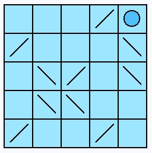
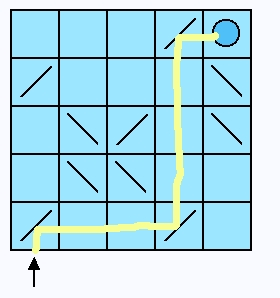
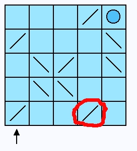
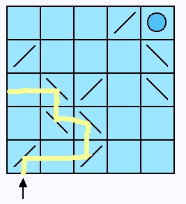
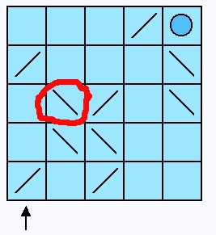
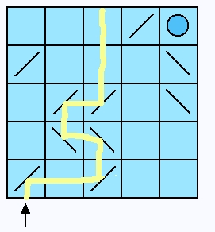
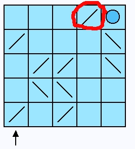
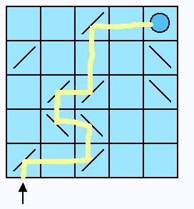

# Introduction

An activity I enjoy is writing simple games in Pharo. I also enjoy sharing this powerful development environment with interested developers. This is one of the reasons I write these tutorials.

For this development example I'd like to try something different and take the student through the process of writing a game in Pharo. Proceed linearly through the example. The development process described here will be very specific to the way I work. Consequently, you will see how I encourage organization of files and other processes as part of Pharo development. In a very real way, Smalltalk development is a personal expression.

Let's assume the student has downloaded Pharo and has some understanding of the Smalltalk programming language.

This work make seem tedious at some points. Every step of the process is described in detail. Even when I made mistakes. The idea here is to show how natural it is to iterate over design and implementation and the confidence that builds with test driven development.

Frequently the pages of the tutorial will be filled with screen-shots of browser windows. Although this may tend to be distracting for some readers, whenever I'm introducing something for the first few times the class hierarchy browser is shown so that the student can examine carefully and compare it to what they are doing in case there are mistakes. After progressing through a lot more of the tutorial it's assumed this convention is no longer necessary and descriptions with code samples are given instead.

The tutorial begins with a fresh download of Pharo 3.9. I'm doing this development on a Macintosh running OS X. With the exception of the host Operating System look-and-feel, and a few different install files, there should be no difference for a student working with other supported Pharo systems. Here's my Pharo development folder's contents at the beginning of this tutorial.

## Backup installation files

The first thing I like to do with a fresh image is back things up. I prefer to keep backup copies of the original Squeak image files in case I need to start over. I usually create a folder named "kit" where I put copies of all the original install files.

Let's launch Squeak and do some initial setup and organization in the environment.

## Image Update

We should check if we need to update our fresh Squeak image. You will need an active Internet connection on your computer before completing this step. You can skip this for later if no Internet access is available.

From the World menu, select the "help..." menu. In the Help menu select "update code from server".

In our example, the image is up-to-date. We are given the option to update our system to Squeak 3.10alpha. Do not do this. A confirmation dialog is presented reminding us to save the image. We will do this shortly.

## Setup

Before we save our image I'd like to set some preferences. Open up Preferences from the "help" menu.

The Preferences window shows a list of categories on a light-blue background. Each category behaves like a Tab control in other control panes you may have experienced in other applications. Select the "browsing" preference category.

I like to activate the "annotationPanes" and "dragNDropWithAnimation" preferences here.

For the "scrolling" preferences I like to turn OFF the "scrollBarsOnRight" option. I like my scrollbars on the left (where the text is).

That's enough for setting preferences for now. Close the window.

Squeak provides a way to "partition" off your work into projects. Each project has its own World. There is also a Change-Set associated with each project, but that's not important to us now.

I tend to organize my Squeak projects all from within one main project. I give that main project the name "sbw", my initials. Let's create that first project. Begin by selecting the "open..." menu. Then choose the "morphic project" menu. A new window appears with the title "Unnamed1". Click somewhere inside the new window to enter it.

## A New Project

The new World opens up and you are presented with a blank environment, except for the flaps. We will not need the flaps so we can turn them off for at least this project World.

From the "flaps..." menu, de-select the "show shared tabs" option.

The flaps disappear. We will now go back to the previous world and rename this project. Choose the "previous project" entry from the World menu.

## Name the Main Project

Click on the name along the bottom of the new project window. The tag should turn red. You can then type in your new project name. Hit Return when you have typed the new name. The title bar of the window will change.

Click once inside your new project window to go back into the project world.

Perform a "save as" operation. I recommend you name the new image "Squeak". This is the default image name. From this point forward, when you re-launch Squeak you will find yourself back at this project world.

Now that we have a saved image, go ahead and quit Squeak. We will not need it right now.

Okay. We're all set to go. Let's explore the game design.

## Game Overview

We're going to write a new game for Squeak. I'm not sure how it will look, that's just one part of this little project. But the following ideas should be represented in our game.

The game will be played on a grid. We will imagine to have a laser beam that can be activated by the user. It will fire inside this grid from a specific location. The laser beam will always fire from the bottom edge underneath the first column of cells. As the laser beam traverses inside our grid it can hit deflecting mirrors. These mirrors will divert the laser beam's direction as it travels. Ultimately the beam should hit a target location inside our grid.

The cells of our grid will either be blank, have a target (shown as a circle here) or a deflecting mirror. The mirrors may be oriented in either of two ways, leaning left or right.

Once the laser is fired we can see how the cells guide the laser to a destination. In this case the laser correctly goes to the target cell.

Initial locations and orientations of the mirror cells will be randomly controlled by the game. In the example the mirrors yield a correct result. However, the user has control over mirror rotation and position (to a certain amount). The user can click on a mirror cell and cause the mirror cell to rotate 90 degress. This would alter the laser's direction. Note that if the laser hits a grid wall it ends its path.

The user may also click on a mirror cell and cause it to slide 1 grid-cell in a vertical or horizontal direction. Note that a mirror cell cannot move through the grid walls nor through another mirror cell nor the target cell. In this way the user can adjust the mirror cells to get a desired result.

Since, initially, this is a solitaire game, it becomes more interesting to have the user manipulate the mirrors to stil have the laser complete its path by hitting the target but also by finding the longest path possible.

For example, the user could move the mirror cell shown, one cell to its left and cause the laser to take an alternate path.

Then by rotating another mirror, get another result.

As a last step, move one more mirror and get the laser to go back to the target cell. This time the path of the laser is longer than before. And ouf course it was strictly a random coincidence that the initial cells configuration already provided a correct path for the laser.

That's the general idea. We can add laser cell-path counters and other game instrumentation as we develop.

## Discovery of Objects

When we look over the game drawings and think about what objects our game may need, a few come immediately to mind. There must be some kind of Grid and several Cells. There are different kinds of Cells too.

Cells and a Grid are obvious objects of the game and we'll probably discover other objects as we explore a little. It's perfectly fine to explore and then throw code away if we later learn we're not heading in the right direction.

Exploring with objects is easy to do with Smalltalk and Squeak. I very much enjoy spending time thinking about designs but I've also learned you need to "dive in" sometimes to better understand the objects needed in your design.

As I once heard someone say, "You can read about swimming all you want. But, you'll never learn about swimming until you actually dive in the water."

Of course we believe the water here is safe. The worst we could do is write some code and throw it away. And that's nothing to worry about. You have a backup copy and can easily begin again if needed. Smalltalk development encourages experimentation and quick idea exploration.

### Grid

The Grid holds our Cells. It also contains the source of our laser beam. Let's go with the idea that the user will "ask" the Grid to fire our laser beam.

### Cells

There are 3 kinds of Cells.

1. Blank, or empty
2. Target
3. Mirror

The basic responsibility of a Cell concerns what happens to the laser beam when it enters the Cell. Also, the Mirror Cells need to know something about their orientation. A Mirror Cells can be thought of as leaning "left" or leaning "right".

If we dig a little deeper into our understanding of these Cells we can imagine that each Cell has 4 internal line-segments. Something like an LED clock. We'll use these segments to indicate the path of the laser beam. Let's explore how that would work with our different Cell types.

#### The Blank Cell

We label the 4 segments #north, #east, #south, and #west. If the laser beam enters the #west segment then we know the #east segment will light-up. If the laser beam enters #south then the #north segment would also light-up.

#### The Mirror Cell

Depending on the orientation of the mirror we can also determine the path of the laser beam through the Cell. We identify the corresponding segments using the same technique.

For the "left" leaning Mirror Cell, if the laser beam enters the #west segment we know the #south segment will also light-up. If the laser beam enters the "right" leaning Mirror Cell from the #west it will exit by the #north segment.

#### The Target Cell

In the case of the Target Cell no other segment will light-up. The laser beam ends its path here.

Visually, each of the three Cell types would render differently. So they can be seen to have some things in common and some things that are unique to each. Let's define our initial classes to be:

* Grid
* BlankCell
* MirrorCell
* TargetCell

We suspect that there may an abstract class that will unify common behavior between the classes. For now, let's not do that and just stick with these classes until the need to create other classes actually exists.

Instances of Grid will be responsible for our grid and overall management of the cells.

Instances of BlankCell will be the default condition in our grid. MirrorCell instances will not be as frequent and will also be contained in our grid. The TargetCell will have one instance in our grid.

## Test Driven Development

As much as practical, we should use the SUnit unit testing framework to implement the game model. More than likely we'll not concern ourselves with writing unit tests for the actual behavior of the GUI. But there's plenty we can accomplish by driving our development of the game model from unit tests.

I'm not too attached to how we code the very first few lines of code. An approach I've seen used by many people is to begin with the Unit Tests, even to the point of not having any objects to test before the first test is written. Another approach is to implement some basic model and then drive from that point forward using Unit Tests.

Unit Tests will help us accomplish several things.

1. Help us to develop our objects.
2. Provide a consistency check as we continue to add code. This helps us to keep from breaking things we've already written that work.

I have found that good unit tests capture your requirements and help you as you implement design. Often, when you write a unit test you are forced to think about your design as if it were finished.

We'll have to do a little more definition in the Squeak development environment before we do anything else. So let's get that out of the way next. Relaunch the Squeak environment if you currently do not have it running. Be sure to choose your previously saved "Squeak.image" file.

## Define the Project for our Game

Just like we did before, we need to create a new Project. Let's call our project "Laser-Game".

Enter the new project.

In the new World, open up a code browser.

In the system category pane on the System Browser, choose "add item" to add a new system category. Use the name "Laser-Game-Model".

We will also want system categories for the graphics and unit test work.

We'll concern ourselves with the actual presentation layer of our game (the graphics) later in the development process.

## Create Some Model Classes

Define the 4 model classes we identified before. Be sure to select "Laser-Game-Model" in the system category first. Each new class will be a subclass of Object.

When you select the Laser-Game-Model category, you see a class creation template on the bottom pane of the Browser. Fill it out as shown, then right-click and press "accept" (or press the keystroke alt-s/cmd-s -- depending on platform)